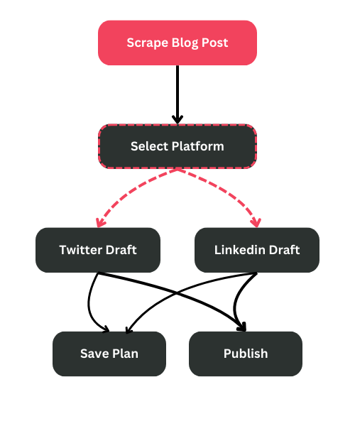

# 📢 Automated Agentic Workflow to Write and Publish Social Content  

I’ve developed a fully automated **multi-agent system** that writes and publishes social media content using an agentic workflow. This system leverages **CrewAI**, **FireCrawl**, and **Typefully API** to efficiently handle everything from scraping content to publishing posts across platforms like **LinkedIn** and **X (formerly Twitter)** — all without manual intervention.  

---

## 🧩 **Tech Stack**  
- **CrewAI** – Used to build the agentic workflow.  
- **FireCrawl** – For web scraping newsletters and saving them as markdown files.  
- **Typefully API** – For scheduling and automatically publishing social media posts.  

---

## 🚀 **How It Works**  
This system is designed to automate the process of writing and publishing social media content. Below is a step-by-step explanation of how it works:  

1. **Input**:  
   I provide a **link to a blog or newsletter** (for example, one of my newsletter issues).  

2. **Web Scraping**:  
   The system uses **FireCrawl** to **scrape the newsletter content**, including images, and saves it as a **markdown file**.  

3. **Content Understanding**:  
   One of the agents accesses my **existing social media posts** to understand my **writing style** and ensure that the generated content stays consistent with my brand tone.  

4. **Multi-Platform Workflow**:  
   I’ve set up **two routers** to handle content for both **LinkedIn** and **X (Twitter)**.  
   - The LinkedIn Router generates content tailored for LinkedIn.  
   - The X Router generates content formatted for X.  
   Based on the input, the appropriate agent gets triggered to write a **ready-to-publish draft**.  

5. **Publishing**:  
   Once the drafts are ready, the system uses **Typefully’s API** to schedule and post the content on my social channels — completely hands-off.  

---

## ⚙️ **Workflow Diagram**  



  

---

## 📋 **Setup Instructions**  
If you’d like to replicate or customize this workflow, here’s how to set it up:  

### **1. Clone the Repository**  
```bash  
git clone https://github.com/mayuras7685/content-planner-agent.git  
cd content-planner-agent
```  

### **2. Install Dependencies**  
Make sure Python and the necessary libraries are installed:  
```bash  
pip install -r requirements.txt  
```  

### **3. Add Your API Keys**  
Create a `.env` file in the root directory and add your API keys:  
```env  
CREWAI_API_KEY=your_crewai_api_key  
FIRECRAWL_API_KEY=your_firecrawl_api_key  
TYPEFULLY_API_KEY=your_typefully_api_key  
```  

### **4. Run the Workflow**  
Run the notebook

---

## 📈 **Agent Roles in the Workflow**  

| Agent         | Role                                  | Description                                               |  
|---------------|---------------------------------------|-----------------------------------------------------------|  
| **Scraper**   | Web Scraping Agent                    | Uses FireCrawl to scrape blog content and convert it to markdown. |  
| **Style Agent** | Writing Style Understanding Agent   | Analyzes past social media content to match my writing style. |  
| **Draft Agent** | Social Media Drafting Agent         | Creates ready-to-publish drafts for LinkedIn and X.        |  
| **Router**    | LinkedIn and X Router Agents          | Routes content to the correct social media platform.       |  
| **Publisher** | Automated Posting Agent               | Uses Typefully API to schedule and post content.           |  
